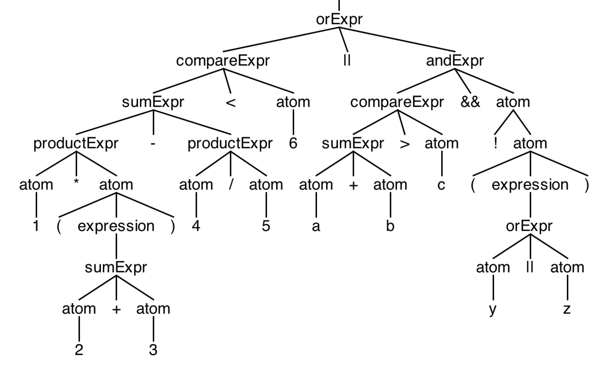
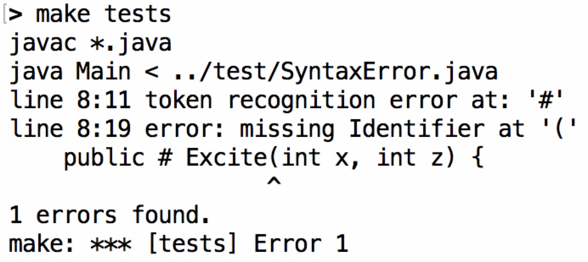
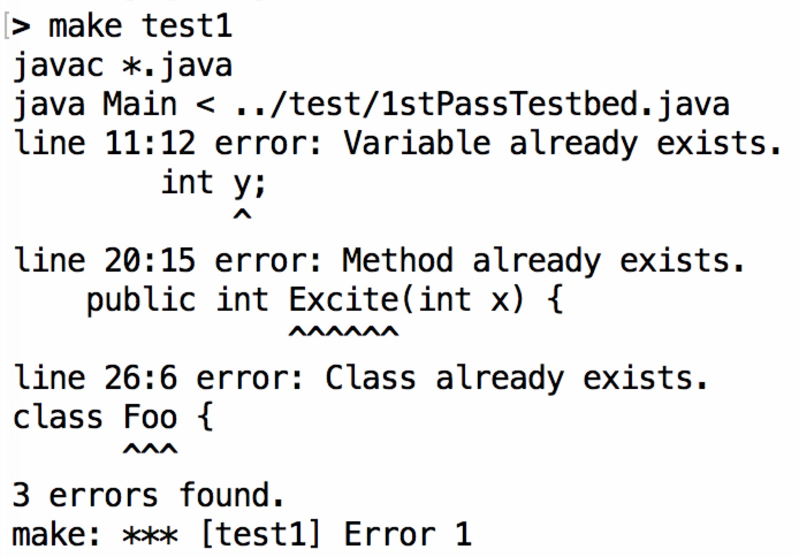
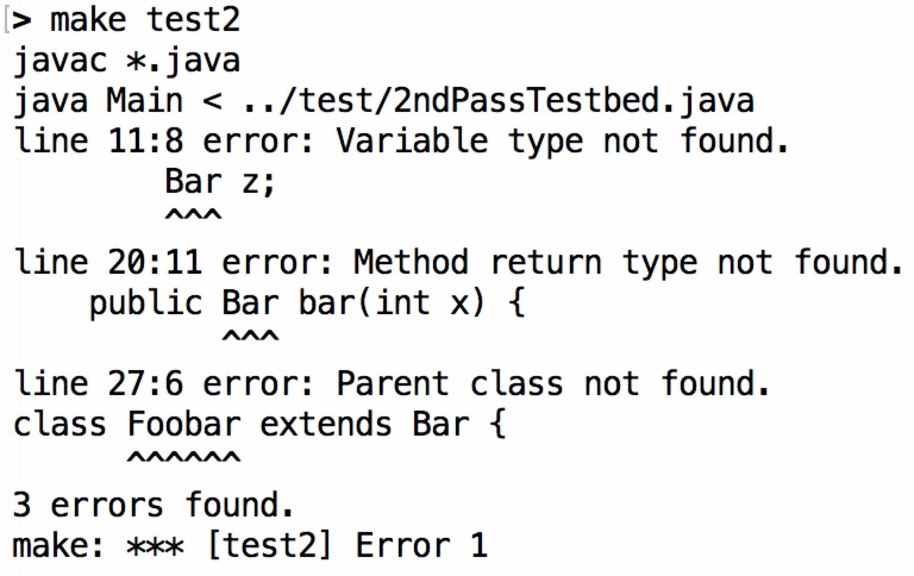
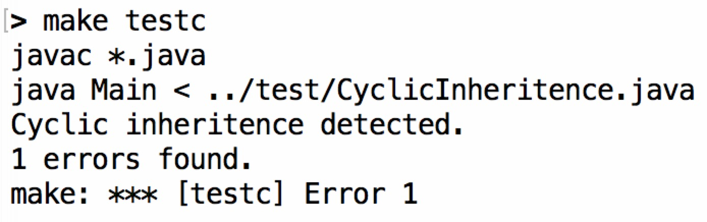
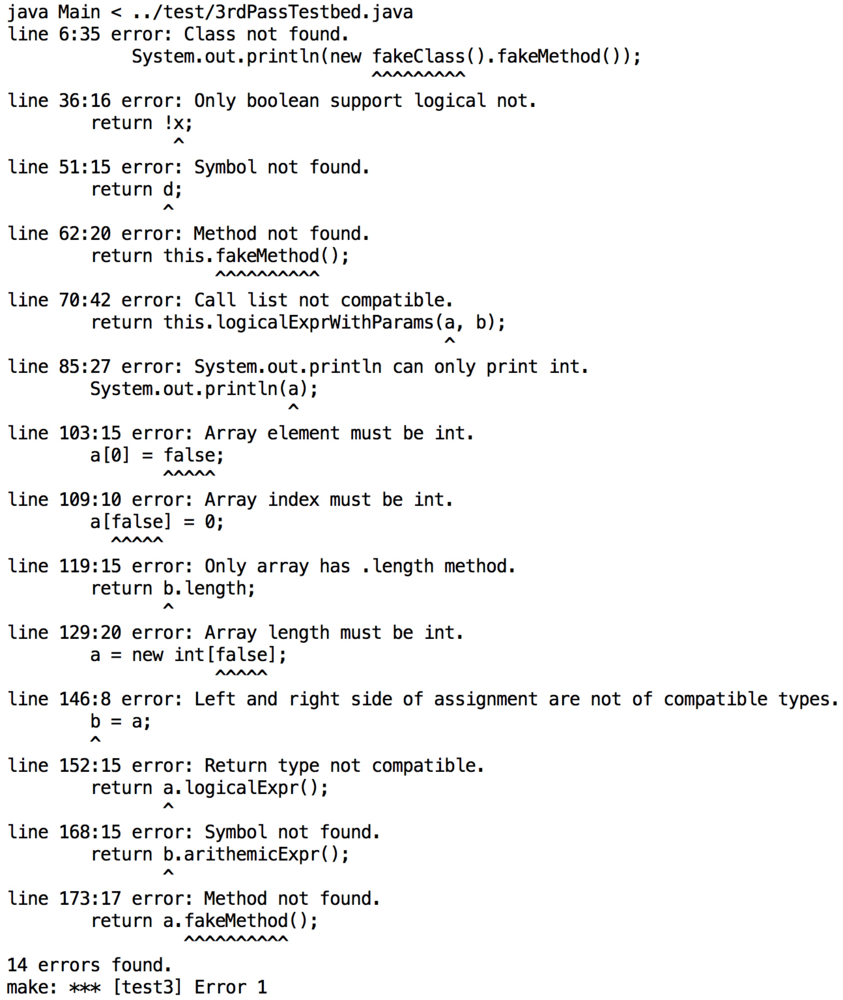

# Project Report for Compilers @ Fudan

## Author

Linghao Zhang ([13307130225@fudan.edu.cn](13307130225@fudan.edu.cn))

## Overview

**MiniJavaCF** is a compiler frontend for [MiniJava](http://www.cambridge.org/us/features/052182060X/index.html) implemented with [ANTLR](http://www.antlr.org/) v4.5.3.

### Functionalities

- Grammar file √ 
    - See `src/MiniJava.g4`.
    
- Output AST √
    - Run `make test` or `make rig` under `src/` to see the result.

- Error handling √
    - Error reporting √
        - Lexcial error √
        - Syntactic error √
        - Semantic error √
    - Error recovery ?
        - For lexical & syntactic error, MiniJavaCF uses **ANTLR's default recovery strategy**, which includes:
            - Single token deletion
            - Single token insertion
            - Sync-and-return
            - ...
        - For semantic error, MiniJavaCF would simply report the error and exit.

- **Highlights**
    - **Support parsing of operator precedence**.
    - **Human-friendly error reporting**.
    - **Comprehensive semantic analysis with type deduction**.

### Source Codes

- `src/`
    - `Class.java`: Encapsulates a class object.
    - `ErrorReporter.java`: 
    - `Main.java`: Main class.
    - `Method.java`: Encapsulates a method object.
    - `Scope.java`: Define an interface for scopes like classes and methods.
    - `ScopeBuilder.java`: First pass of semantic analysis.
    - `Symbol.java`: Define a class for symbols like classes and methods.
    - `SymbolChecker.java`: Second pass of semantic analysis.
    - `SyntaxErrorListener.java`: Customized error listener
    - `TypeChecker.java`: Third pass of semantic analysis.
    - `TypeEvaluator.java`: Visitor for type deduction.

Note that ANTLR-generated lexer & parser & listener & visitor codes are omitted here.

## About ANTLR

ANTLR is a parser generator. It can generate lexer and parser from a given grammar file. The lexer will convert the input source code into a list of tokens, which is then read and converted to an AST by the parser.

ANTLR has at least two advantages which makes it very suitable for this project:

- ANTLR provides two ways of operating on an AST: listeners and visitors. Since many analyses are essentially **traversing an AST**, it's safe to say that ANTLR gives adequate abstraction and encapsulation.
- ANTLR has **powerful built-in strategy** with error reporting and error recovery. And it also provides interfaces for us to **change the default behavior**.

## Workflow

1. Lexical & syntactic analysis
    - Already taken care by ANTLR-generated lexer & parser.
2. First pass of semantic analysis
    - Build the scope tree.
    - Check for duplicated declaration.
3. Second pass of semantic analysis
    - Check for existences of variable type & method return type.
    - Check for cyclic inheritence.
4. Third pass of semantic snalysis
    - Check for symbol reference.
    - Check for type compatibility.

Three passes of semantic analysis are all traversing the AST we obtained from step 1. Therefore, the main classes in three passes all inherit from `MiniJavaBaseListener`.

Note that encountering unrecoverable errors in each of these steps will cause MiniJavaCF to exit early.

## Approach

### Grammar Expansion

We made some changes to the [original MiniJava grammar](http://www.cambridge.org/us/features/052182060X/grammar.html).

These are expanded to allow for recursive (thus easier) parsing:

    paramList
        : ptype=type name=Identifier
        | ptype=type name=Identifier ',' paramList
        ;

    callList
        : rightValue
        | rightValue ',' callList
        ;

These are expanded to match the corresponding method quicker:

    statement
        : '{' (statement)* '}'
        | ifStatement
        | whileStatement
        | printStatement
        | assignment
        | arrayAssignment
        ;

    ifStatement
        : 'if' '(' expression ')' statement 'else' statement;

    whileStatement
        : 'while' '(' expression ')' statement;

    printStatement
        : 'System.out.println' '(' expression ')' ';';

    assignment
        : name=Identifier '=' rightValue ';';

    arrayAssignment
        : name=Identifier '[' expression ']' '=' expression ';';

#### Expression

The most significant change is about expressions. The motivation here is to support the parsing of operator precedence. The problem with the original grammar is that its `expression` contains too many things. With closer examination, we find that it can be splitted into two parts.

We define `atom` to be expressions that can evaluate to primitive types; while `nonAtom` to be those that can't. We can see that logical and arithemic expressions only involve `atom`. Therefore, we have:

    expression
        : orExpr
        | andExpr
        | compareExpr
        | sumExpr
        | productExpr
        | atom
        ;

Where the meaning `orExpr`, `andExpr`, `compareExpr`, `sumExpr` and `productExpr` are self-evident. By matching sub-rules in this order, we are able to parse the operator precedence of complicated expressions.

As for `atom` and `nonAtom`, we have:

    atom
        : Int
        | bool='true'
        | bool='false'
        | array '[' atom ']'
        | array '.' 'length'
        | nonAtom '.' name=Identifier '(' callList? ')'
        | name=Identifier
        | '!' atom
        | '(' expression ')'
        ;

    nonAtom
        : nonAtom '.' name=Identifier '(' callList? ')'
        | name=Identifier
        | self='this'
        | create='new' name=Identifier '(' ')'
        | '(' expression ')'
        ;

Among sub-rules of `atom`, some will definitely evaluate to primitive types, such as `Int`; some may evaluate to primitive types, such as `nonAtom '.' name=Identifier '(' callList? ')'`. The same applies to `nonAtom`. We will leave this for `typeEvaluator` to decide.

Now that `expression` purely defines logical and arithemic expressions, we introduce another rule `rightValue`:

    rightValue
        : expression
        | nonAtom
        | array
        ;

We only have `rightValue` with assignments and method calls.

Now the new grammar works.

### Scope Design

Our task in the first pass of semantic analysis is to build a AST-like tree to store all the information we need for later use. In the context of MiniJava, the hierarchy is quite simple: `top level -> class -> method`. We could do it naively, defining a `Class` class and a `Method` class to do whatever they need to do. However, here we choose to have some level of abstraction for better maintainability and scalability.

Classes and methods share two commonalities: 1) they are both symbols; 2) they both define a scope. Therefore, we define a class `Symbol` and an interface `Scope`. Then we let `Class` and `Method` inherit from `Symbol` and implements methods in `Scope`:

    public class Class extends Symbol implements Scope {
        // ...
    }

#### Symbol

Each symbol has a name and a type. In `Symbol.java` we define two important static methods:

    public static boolean isPrimitiveType(String type) {
        return type.equals("int") || type.equals("int[]") || type.equals("boolean");
    }

    // Assume that: A <- B
    public static boolean isTypeCompatible(String typeA, String typeB) {
        if (typeA.equals(typeB))
            return true;
        else if (Symbol.isPrimitiveType(typeA) || Symbol.isPrimitiveType(typeB))
            return false;
        while (!typeB.equals("<No Parent Class>")) {
            if (typeA.equals(typeB))
                return true;
            // System.out.println("typeB: " + typeB);
            typeB = Main.classes.get(typeB).getParentClassName();
        }
        return false;
    }

The logic here should be pretty clear.

#### Scope

Each scope has a parent scope and a local symbol table. For `Method`, we also need a separate container to store the information of parameters. When looking up for a symbol inside a scope, we can do it locally or recursively:

    @Override
    public Symbol findSymbol(String name) {
        if (symbols.containsKey(name))
            return symbols.get(name);
        else {
            if (this.getParentScope() == null)
                return null;
            else
                return this.getParentScope().findSymbol(name);
        }
    }

    @Override
    public Symbol findLocalSymbol(String name) {
        return symbols.get(name);
    }

### First Pass: ScopeBuilder

In the first pass, our task is to traverse the AST and build a scope tree, as well as storing all the information in it.

We use `currentScope` to indicate which scope we are in. And initially we will create a fake scope object to represent the top-level scope:

    public static Scope virtualSuperScope = new Class("<Virtual Super Scope>", "<No Parent Class>", null);

Then we override the necessary `enter` and `exit` methods from `MiniJavaBaseListener`. We extract the information from AST, check if there is duplicated declaration, and create the corresponding objects along the way.

Take `enterMethodDeclaration` for example:

    @Override
    public void enterMethodDeclaration(MiniJavaParser.MethodDeclarationContext ctx) {
        String methodName = ctx.name.getText();
        String methodReturnType = ctx.rtype.getText();
        boolean valid = currentScope.isValid();

        if (currentScope.findLocalSymbol(methodName) != null) {
            ErrorReporter.reportError(ctx.name, "Method already exists.");
            valid = false;
        }
        Method currentMethod = new Method(methodName, methodReturnType, currentScope, valid);
        if (valid) {
            currentScope.addSymbol(currentMethod);
        }
        currentScope = currentMethod;
    }

Note that there is a concept of scope validity in the codes above. The motivation here is that, when there is duplicated declaration, we want to detect all the errors as well as suppress potential errors messages from a invalid declaration. Therefore, we will still finish the traversal, but we also need to maintain a validity flag to decide whether we really need to take actions (create the object, add symbol, ...) in the current scope.

### Second Pass: SymbolChecker

In the second pass, our task is to check if there are symbol reference errors. This includes `parent class not found`, `variable type not found` and `method return type not found`. Initially, we want to detect `symbol not found` errors as well. However, it turns out that the lookup for general symbols ties more closely with type checking. Therefore, we decide to move this part to the third pass.

Take `enterVarDeclaration` for example:

    @Override
    public void enterVarDeclaration(MiniJavaParser.VarDeclarationContext ctx) {
        String varName = ctx.name.getText();
        String varType = ctx.vtype.getText();
        Symbol currentVar = (Symbol)currentScope.findLocalSymbol(varName);
        if (!Symbol.isPrimitiveType(varType) && classes.get(varType) == null) {
            ErrorReporter.reportError(ctx.vtype, "Variable type not found.");
        }
    }

Another thing we do here is to check for cyclic inheritence. Since each class can only inherit from at most one parent class, the problem is reduced to determining the existence of cycle in a graph where each vertex has at most one outgoing edge. A simple DFS will do.

    public void checkCyclicInheritence() {
        Map<String, Integer> mapping = new HashMap<String, Integer>();
        Iterator iter = classes.keySet().iterator();
        int mark = 0;
        while (iter.hasNext()) {
            String className = classes.get(iter.next()).getName();
            if (mapping.containsKey(className))
                continue;
            mark += 1;
            while (!className.equals("<No Parent Class>")) {
                if (mapping.containsKey(className)) {
                    if (mapping.get(className).equals(mark))
                        ErrorReporter.reportError("Cyclic inheritence detected.");
                    break;
                } 
                mapping.put(className, mark);
                className = classes.get(className).getParentClassName();
            }
        }
    }

### Third Pass: TypeChecker & TypeEvaluator

In the third pass, our task is to perform symbol lookup and type compatbility checks for assignments, method calls and if/while/print statements where there will be expression evaluation.

The approach is simple. Whenever an evaluation is needed, we invoke `TypeEvaluator`, which will recursively solve for the final return type using the grammar and the information contained in the scope tree we built earlier.

Take the evaluation of `nonAtom` for example, as it's the most complicated one:

    else if (ctx.nonAtom() != null) {
        String objectName = visit(ctx.nonAtom());
        String methodName = ctx.name.getText();
        String callList = (ctx.callList() != null ? visit(ctx.callList()) : "");
        Class object = (Class)(typeChecker.getCurrentScope().findSymbol(objectName));
        if (object == null) {
            ErrorReporter.reportError(objectName, ctx.nonAtom(), "Object not found.");
            return "<Type Error>";
        }
        Method method = (Method)object.findSymbol(methodName);
        if (method == null) {
            ErrorReporter.reportError(ctx.name, "Method not found.");
            return "<Type Error>";
        }
        if (!method.isCallListCompatible(callList)) {
            ErrorReporter.reportError(ctx.callList(), "Call list not compatible.");
            return "<Type Error>";
        }
        return method.getReturnType();
    }

The logic here should be pretty clear.

### Error Reporting

To have more human-friendly error reporting, we define a `ErrorReporter` class to be used for all the errors we encounter.

We define the template of a error message to be:

    "line " + offendingToken.getLine() + ":" + offendingToken.getCharPositionInLine() + " error: " + msg)

Which is followed (if applicable) by two lines, displaying the corresponding line of source code and underlining the offending token.

#### Underlining Errors

This snippet is taken from *The Definitive ANTLR 4 Reference*.

    public static void underlineError(Token offendingToken) {
        String errorLine = Main.inputLines[offendingToken.getLine() - 1];
        System.err.println(errorLine);
        for (int i = 0; i < offendingToken.getCharPositionInLine(); i ++)
            System.err.print(" ");
        int start = offendingToken.getStartIndex();
        int stop = offendingToken.getStopIndex();
        if (start >= 0 && stop >= 0) {
            for (int i = start; i <= stop; i ++) System.err.print("^");
        }
        System.err.println();
    }

#### Suppressing Cascading Error Messages

Sometimes (especially in type checking), an error can result in a chain of errors and we prefer to display only the first one. To suppress this kind of cascading error messages, we report the error immediately after discovering it, and returning a special token to indicate that further errors should be suppressed. For instance in `visitOrExpr` of `TypeEvaluator.java`:

    if (!left.equals("boolean")) {
        ErrorReporter.reportError(ctx.getChild(0), "Only boolean support logical or.");
        return "<Type Error>";
    }

And in `ErrorReporter.java`:

    public static void reportError(String type, Token offendingToken, String msg) {
        if (!type.equals("<Type Error>"))
            reportError(offendingToken, msg);
    }

Then we can pass the evaluated type to `reportError` and avoid cascading errors.

#### Polymorphism

It's worth mentioning that, depending on which part of a rule context we are evaluating type with, the element we have at hand might be `Token`, `ParserRuleContext` or `ParseTree`. Since Java is not a dynamic language, we must use polymorphism here. 

## Tests

In this section we present some erroneous input codes we use for testing and the corresponding screenshots. Most errors should be self-evident.

### Operator Precedence

For the expression `1 * (2 + 3) - 4 / 5 < 6 || a + b > c && !(y || z)`, MiniJava correctly gives this:

### Syntax Error

**SyntaxError.java**

    class Testbed {
        public static void main(String[] x){
            System.out.println(new Foo().Excite(5, 6));
        }
    }

    class Foo {
        public # Excite(int x, int z) {
            if (x < 1)
                y = 1;
            else 
                y = x * (this.Excite(x-1));
            return x + y + z;
        }
    }

### Error Recovery

**ErrorRecovery.java**

    class Factorial {
        public static void main(String[] a){
            System.out.println(new Fac().ComputeFac(10));
        // }
    }

    class Fac {
        public int ComputeFac(int num) {
            int num_aux;
            if (num < 1) {
                num_aux = 0;
            }
            else {
                num_aux = num * (this.ComputeFac(num - 1)) ;
            }
            return num_aux ;
        }
    }

We can see that the missiong token `}` is automatically inserted and the parsing goes on.

### First Pass

**1stPassTestbed.java**

    class Testbed {
        public static void main(String[] x){
            System.out.println(new Foo().Excite(5));
        }
    }

    class Foo {
        public int Excite(int x, int z) {
            int y;
            // Error #1
            int y;
            if (x < 1)
                y = 1;
            else 
                y = x * (this.Excite(x-1));
            return y;
        }

        // Error #2
        public int Excite(int x) {
            return 0;
        }

    }

    class Foo {
        public int ExciteX(int x) {
            return 0;
        }
    }

    // Error #3
    class Bar extends Foo {
        public int ExciteY(int x) {
            return 0;
        }
    }

### Second Pass

**2ndPassTestbed.java**

    class Testbed {
        public static void main(String[] x) {
            System.out.println(new Foo().foo(5));
        }
    }

    class Foo {
        public int foo(int x) {
            int y;
            // Error #1
            Bar z;
            if (x < 1)
                y = 1;
            else 
                y = x * (this.biu(x-1));
            return y;
        }

        // Error #2
        public Bar bar(int x) {
            return 0;
        }

    }

    // Error #3
    class Foobar extends Bar {
        public int foobar(int x) {
            return 0;
        }
    }

### Cyclic Inheritence

**CyclicInheritence.java**

class Testbed {
    public static void main(String[] x){
        System.out.println(new Foo().Excite(5));
    }
}

class Foo extends Bar {
    public int Excite(int x) {
        int y;
        Bar z;
        if (x < 1)
            y = 1;
          else 
            y = x * (this.Excite(x-1));
        return y;
    }
}

class Bar extends Foo {
    public int ExciteY(int x) {
        return 0;
    }
}

### Third Pass

**3rdPassTestbed.java**

class Testbed {
    public static void main(String[] x) {
        // Test new
        {
            // Error #1
            System.out.println(new fakeClass().fakeMethod());
            System.out.println(new A().arithemicExpr());
        }
    }
}

class A {
    int a;
    int b;
    int c;
    boolean x;
    boolean y;
    boolean z;

    // Test expressions

    public int arithemicExpr() {
        return 0;
    }

    public boolean logicalExpr() {
        return true;
    }

    public boolean logicalNotValid(boolean x) {
        return !x;
    }

    // Error #2
    public boolean logicalNotInvalid(int x) {
        return !x;
    }

    public boolean testPrecedenceValid() {
        return 1 * (2 + 3) - 4 / 5 < 6 || a + b > c && !(y || z);
    }

    // Test symbol lookup

    public int localSymbolFound() {
        return a;
    }

    // Error #3
    public int localSymbolNotFound() {
        return d;
    }

    // Test method calls

    public boolean testThis() {
        return this.testPrecedenceValid();
    }

    // Error #4
    public boolean localMethodNotFound() {
        return this.fakeMethod();
    }

    public boolean logicalExprWithParams(boolean a, boolean b) {
        return a && b;
    }

    public boolean callListCompatible(boolean a, int b) {
        return this.logicalExprWithParams(a, b);
    }

    // Error #5
    public boolean callListIncompatible(boolean a, boolean b) {
        return this.logicalExprWithParams(a, b);
    }
    
    public int testSystemOutPrintlnValid(int a) {
        System.out.println(a);
        return 0;
    }

    // Error #6
    public int testSystemOutPrintlnInvalid(boolean a) {
        System.out.println(a);
        return 0;
    }
}

class B extends A {
    int[] a;
    int b;

    // Test arrays

    public int arrayAssignmentValid() {
        a[0] = 0;
        return 0;
    }

    // Error #7
    public int arrayAssignmentInvalid() {
        a[0] = false;
        return 0;
    }

    // Error #8
    public int arrayIndexingInvalid() {
        a[false] = 0;
        return 0;
    }

    public int arrayLengthValid() {
        return a.length;
    }

    // Error #9
    public int arrayLengthInvalid() {
        return b.length;
    }

    public int arrayInitializationValid() {
        a = new int[10];
        return 0;
    }

    // Error #10
    public int arrayInitializationInvalid() {
        a = new int[false];
        return 0;
    }    
}

class C {
    // Test type deduction with inheritence

    A a;

    public A assignmentCompatible(A a, B b) {
        a = b;
        return a;
    }

    // Error #11
    public B assignmentIncompatible(A a, B b) {
        b = a;
        return b;
    }

    // Error #12
    public int returnNonAtomIncompatible(A a) {
        return a.logicalExpr();
    }

    public int returnNonAtomCompatible(A a) {
        return a.arithemicExpr();
    }

    // Test symbol & object lookup

    public int methodLocalLookup() {
        // This shouldn't raise an error.
        A a;
        return 0;
    }

    public int objectNotFound(A a) {
        return b.arithemicExpr();
    }

    // Error #13
    public int objectFoundMethodNotFound(A a) {
        return a.fakeMethod();
    }

    // Error #14
    public int objectFoundMethodFound(A a) {
        return a.arithemicExpr();
    }    
}

## Discussions

### Limitations

- MiniJavaCF cannot underline errors involving multiple offending tokens.
- MiniJavaCF cannot recover from any semantic errors.

### Future Works

There's a couple of things that can be easily done to make MiniJava more human-friendly:

- Support void method.
- Support multiple variable declaration in one line.
- Support variable declaration and initialization in the same line.
- Check to make sure that each variable is initialzed before use.

### Thoughts

- This project is much fun.
- Tweaking grammar to make parsing easier is where magic happens.
- Designing the scope tree and the three passes of semantic analysis is a good way to improve OOP skills.
- If possible, one is definitely going to gain more by building a complete compiler!
