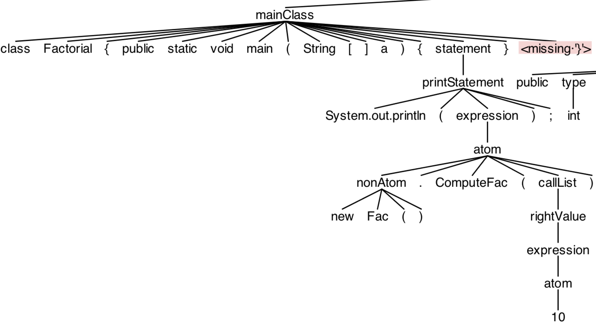

# Project Report for Compilers @ Fudan

## Author

Linghao Zhang ([13307130225@fudan.edu.cn](13307130225@fudan.edu.cn))

## Overview

**MiniJavaCF** is a compiler frontend for [MiniJava](http://www.cambridge.org/us/features/052182060X/index.html) implemented with [ANTLR](http://www.antlr.org/) v4.5.3.

### Functionalities

- Grammar file √ 
    - See `src/MiniJava.g4`.
    
- Output AST √
    - Run `make test` or `make rig` under `src` to see that result.

- Error handling √
    - Error reporting √
        - Lexcial errors √
        - Syntactic errors √
        - Semantic errors √
    - Error recovery ×
        - For lexical & syntactic errors, MiniJavaCF uses ANTLR's default recovery strategy, which includes:
            - Single token deletion
            - Single token insertion
            - Sync-and-return
            - ...
        - For semantic errors, MiniJavaCF simply report the error and exits.

- Highlights
    - Support parsing of operator precedence.
    - Human-friendly error reporting.
    - Comprehensive semantic analysis with type deduction.

### Source Codes

- `src/`
    - `Class.java`: Encapsulates a class object.
    - `ErrorReporter.java`: 
    - `Main.java`: Main class.
    - `Method.java`: Encapsulates a method object.
    - `Scope.java`: Define an interface for scopes like classes and methods.
    - `ScopeBuilder.java`: First pass of semantic analysis.
    - `Symbol.java`: Define for symbols like classes and methods.
    - `SymbolChecker.java`: Second pass of semantic analysis.
    - `SyntaxErrorListener.java`: Customized error listener
    - `TypeChecker.java`: Third pass of semantic analysis.
    - `TypeEvaluator.java`: 

Note that ANTLR-generated lexer & parser & listener & visitor codes are omitted here.

## About ANTLR

## Workflow

1. Lexical & Syntactic Analysis
    - Already taken care by ANTLR-generated lexer & parser.
2. First pass of Semantic Analysis
    - Build the scope tree
    - Check for duplicated declaration
3. Second pass of Semantic Analysis
    - Check for existences of variable type & method return type  
    - Check for cyclic inheritence
4. Third pass of Semantic Analysis
    - Check for symbol reference
    - Check for type compatibility 

Three passes of semantic analysis are all traversing the AST we obtained from step 1. Therefore,

Note that encountring unrecoverable errors in each of these steps will cause MiniJavaCF to exit early.

## Subtlties

### Grammar Expansion

#### Expression

The most significant change MiniJavaCF made to the original MiniJava grammar is about expressions. The motivation here is to support.

Therefore we define `atom` to be expressions that can evaluate to primitive types; while `nonAtom` to be those that can't.

### Scope Design

Our task in the first pass of semantic analysis is to build a AST-like tree to store all the information we need for later use. In the context of MiniJava, the hierarchy is quite simple: top level -> class -> method. We could do it naively, defining a `Class` class and a `Method` class to do whatever they need to do. However, here we choose to have some level of abstraction for better maintainability and scalability.

Classes and methods share two commonalities: 1) they are both symbols; 2) they both define a scope. Therefore, we define a class `Symbol` and an interface `Scope`. Then we let `Class` and `Method` inherit from `Symbol` and implements methods in `Scope`:

    public class Class extends Symbol implements Scope {
        // ...
    }

#### Symbol

Each symbol has a name and a type. In `Symbol.java` we define two necessary methods:

    public static boolean isPrimitiveType(String type) {
        return type.equals("int") || type.equals("int[]") || type.equals("boolean");
    }

    // Assume that: A <- B
    public static boolean isTypeCompatible(String typeA, String typeB) {
        if (typeA.equals(typeB))
            return true;
        else if (Symbol.isPrimitiveType(typeA) || Symbol.isPrimitiveType(typeB))
            return false;
        while (!typeB.equals("<No Parent Class>")) {
            if (typeA.equals(typeB))
                return true;
            // System.out.println("typeB: " + typeB);
            typeB = Main.classes.get(typeB).getParentClassName();
        }
        return false;
    }

#### Scope

Each scope has a parent scope and a local symbol table. For `Method`, we also need a separate container to store the information of parameters. When looking up for a symbol inside a scope, we can do it locally or recursively:

    @Override
    public Symbol findSymbol(String name) {
        if (symbols.containsKey(name))
            return symbols.get(name);
        else {
            if (this.getParentScope() == null)
                return null;
            else
                return this.getParentScope().findSymbol(name);
        }
    }

    @Override
    public Symbol findLocalSymbol(String name) {
        return symbols.get(name);
    }

### First Pass: ScopeBuilder

In the first pass, our task is to traverse the AST and build a scope tree, as well as storing all the information in it.

We use `currentScope` to indicate which scope we are in. And initially we will create a fake scope object to represent the top-level scope.

    public static Scope virtualSuperScope = new Class("<Virtual Super Scope>", "<No Parent Class>", null);

Then we override all the listener methods (both enter and exit) of `MiniJavaBaseListener.java`. We extract the information from AST, check if there's duplicated declaration, and create the corresponding objects along the way.

Take `enterMethodDeclaration` for example:

    @Override
    public void enterMethodDeclaration(MiniJavaParser.MethodDeclarationContext ctx) {
        String methodName = ctx.name.getText();
        String methodReturnType = ctx.rtype.getText();
        boolean valid = currentScope.isValid();

        if (currentScope.findLocalSymbol(methodName) != null) {
            ErrorReporter.reportError(ctx.name, "Method already exists.");
            valid = false;
        }
        Method currentMethod = new Method(methodName, methodReturnType, currentScope, valid);
        if (valid) {
            currentScope.addSymbol(currentMethod);
        }
        currentScope = currentMethod;
    }

Note that there is a concept of scope validity in the codes above. The motivation here is that when there is duplicated declaration, we want to detect all the errors as well as suppress potential error reports in a invalid declaration. Therefore, we still need to finish the AST traversal, but we need to maintain a validity flag to decide whether we really need to take actions in the current scope.

### Second Pass: SymbolChecker

In the second pass, our task is to check if there are symbol reference errors. This includes `parent class not found`, `variable type not found` and `method return type not found`. Initially, we want to detect `symbol not found` errors as well. However, it turns out that the lookup for general symbols ties more closely with type checking. Therefore, we decide to move this part to the thrid pass.

Take `enterVarDeclaration` for example:

    @Override
    public void enterVarDeclaration(MiniJavaParser.VarDeclarationContext ctx) {
        String varName = ctx.name.getText();
        String varType = ctx.vtype.getText();
        Symbol currentVar = (Symbol)currentScope.findLocalSymbol(varName);
        if (!Symbol.isPrimitiveType(varType) && classes.get(varType) == null) {
            ErrorReporter.reportError(ctx.vtype, "Variable type not found.");
        }
    }

Another thing we do here is to check for cyclic inheritence. Since each class can only inherit from at most one parent class, the problem reduces to determining the existence of cycle in a graph where each vertex has at most one outgoing edge. A simple DFS can solve it.

    public void checkCyclicInheritence() {
        Map<String, Integer> mapping = new HashMap<String, Integer>();
        Iterator iter = classes.keySet().iterator();
        int mark = 0;
        while (iter.hasNext()) {
            String className = classes.get(iter.next()).getName();
            if (mapping.containsKey(className))
                continue;
            mark += 1;
            while (!className.equals("<No Parent Class>")) {
                if (mapping.containsKey(className)) {
                    if (mapping.get(className).equals(mark))
                        ErrorReporter.reportError("Cyclic inheritence detected.");
                    break;
                } 
                mapping.put(className, mark);
                className = classes.get(className).getParentClassName();
            }
        }
    }

### Third Pass: TypeChecker & TypeEvaluator

### Error Reporting

To have more human-friendly error reporting, we define a `ErrorReporter` class to be used everywhere.

We define the template of a error report to be:

    "line " + offendingToken.getLine() + ":" + offendingToken.getCharPositionInLine() + " error: " + msg)

Which is followed (if applicable) by two lines, displaying the corresponding line of source code and underlining the offending token.

#### Underlining Errors

This snippet is taken from *The Definitive ANTLR 4 Reference*.

    public static void underlineError(Token offendingToken) {
        String errorLine = Main.inputLines[offendingToken.getLine() - 1];
        System.err.println(errorLine);
        for (int i = 0; i < offendingToken.getCharPositionInLine(); i ++)
            System.err.print(" ");
        int start = offendingToken.getStartIndex();
        int stop = offendingToken.getStopIndex();
        if (start >= 0 && stop >= 0) {
            for (int i = start; i <= stop; i ++) System.err.print("^");
        }
        System.err.println();
    }

#### Suppressing Cascading Errors

Sometimes (especially in type checking), an error can result in a chain of errors and we prefer to display only the first one. To suppress this kind of cascading errors, we report the error immediately after discovering it, and returning a special token to indicate that further errors should be suppressed. For instance in `visitOrExpr` of `TypeEvaluator.java`:

    if (!left.equals("boolean")) {
        ErrorReporter.reportError(ctx.getChild(0), "Only boolean support logical or.");
        return "<Type Error>";
    }

And in `ErrorReporter.java`:

    public static void reportError(String type, Token offendingToken, String msg) {
        if (!type.equals("<Type Error>"))
            reportError(offendingToken, msg);
    }

Then we can pass the evaluated type to `reportError` and avoid cascading errors.

#### Polymorphism

It's worth mentioning that, depending on which part of a rule context we are evaluating type with, the element we have at hand might be `Token`, `ParserRuleContext` or `ParseTree`. Since Java is not a dynamic language, we must apply polymorphism here. 

## Screenshots

### Operator Precedence

### Syntax Errors

### Error Recovery

### First Pass

### Second Pass

### Cyclic Inheritence

### Third Pass

## Discussions

### Limitations

- For now, MiniJavaCF cannot underline errors involving multiple offending tokens.

### Future Works

There's a couple of things that can be easily done to make MiniJava more human-friendly:

- Support void method.
- Support multiple variable declaration in one line.
- Support variable declaration and initialization in the same line.
- Check to make sure that each variable is initialzed before use. 
